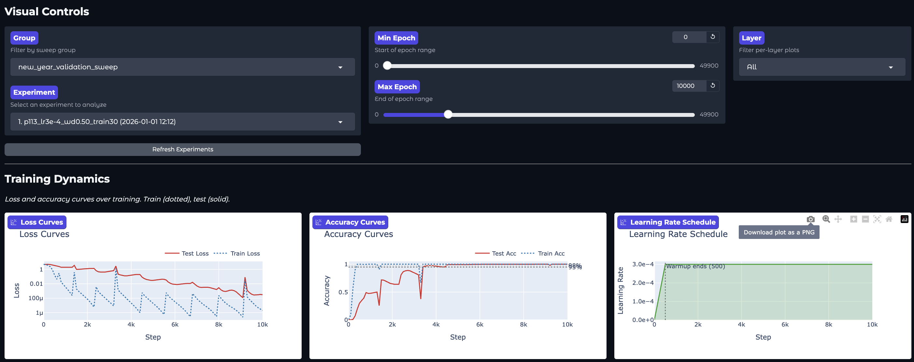
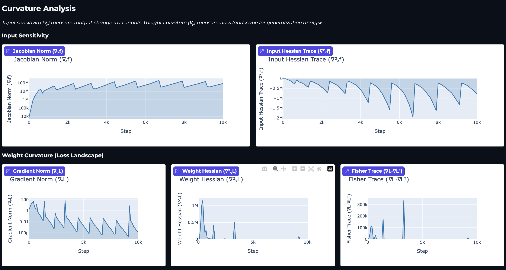
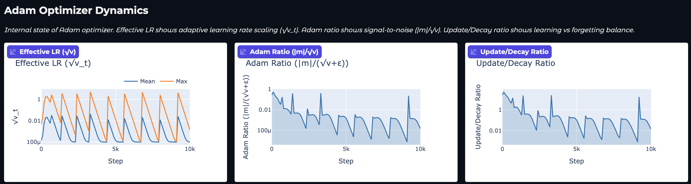
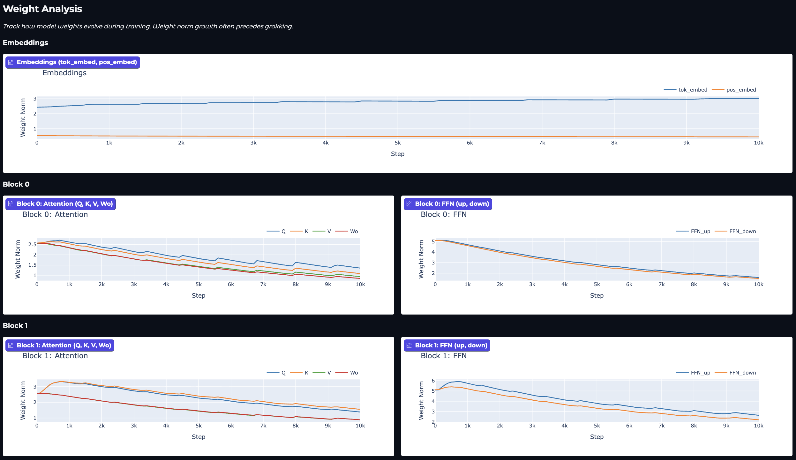

# Least Action Learning

Investigating grokking in neural networks through training dynamics analysis.

## What is Grokking?

Grokking is the phenomenon where neural networks first memorize training data (high train accuracy, low test accuracy), then suddenly generalize after extended training. This project provides tools for training models that exhibit grokking on modular arithmetic tasks, and analyzing the dynamics of this transition.

## Quick Start

### Environment Setup

```bash
# From repository root
source .venv/bin/activate
```

### Run Your First Experiment

```bash
# Quick validation (p=17, ~5-10k epochs to grok)
python projects/least_action_learning/scripts/train.py \
    --config projects/least_action_learning/configs/validate_transformer.yaml

# Full transformer experiment (p=113)
python projects/least_action_learning/scripts/train.py \
    --config projects/least_action_learning/configs/transformer.yaml

# Run hyperparameter sweep (18 experiments)
python projects/least_action_learning/scripts/run_sweep.py \
    --config projects/least_action_learning/configs/transformer_sweep.yaml
```

### Launch the Visualizer

```bash
python -m projects.least_action_learning.visualizer
```

Then open http://localhost:7860 in your browser.

## Visualizer Walkthrough

The Gradio visualizer provides interactive exploration of experiment results across multiple metric categories.

### Visual Controls & Training Dynamics



**Controls (top):**
- **Group**: Filter experiments by sweep group (auto-detected from naming patterns)
- **Experiment**: Select which experiment to analyze
- **Epoch Range**: Zoom into specific training phases

**Training Dynamics plots:**
- **Loss Curves**: Train (dotted) vs Test (solid) on log scale. Watch for the loss drop that signals grokking.
- **Accuracy Curves**: The key grokking signature is test accuracy suddenly jumping from chance to near-perfect.
- **Learning Rate**: Shows warmup phase (linear ramp from 0 to target LR).

### Curvature Analysis



These metrics reveal how the model's sensitivity and loss landscape evolve:

**Input Sensitivity (top row):**
- **Jacobian Norm**: How much outputs change with input perturbations
- **Hessian Trace**: Second-order input curvature

**Loss Landscape (bottom row):**
- **Gradient Norm**: Magnitude of weight gradients (optimization activity)
- **Weight Hessian Trace**: Curvature of the loss surface
- **Fisher Trace**: Empirical Fisher information (optimization landscape structure)

### Adam Optimizer Dynamics



These metrics show the internal state of the Adam optimizer:

- **Effective LR**: Derived from sqrt(v_t). Oscillations indicate learning phases.
- **Adam Ratio**: |m_t|/sqrt(v_t) - signal-to-noise ratio in gradient estimates
- **Update/Decay Ratio**: Balance between gradient updates and weight decay regularization

### Weight Analysis



Per-layer weight norm evolution during training:

- **Embeddings**: Input/output embedding weights
- **Block 0/1**: Attention and FFN components per transformer block

Key insight: Weight norm changes often precede or accompany grokking. The compression of weights is associated with finding generalizing solutions.

## Learn More

- **Research Plan**: See [plan.md](plan.md) for hypothesis, experimental design, architecture diagrams, and success criteria
- **Development Guide**: See [CLAUDE.md](CLAUDE.md) for code structure, configuration options, and API documentation
- **Analysis Examples**: The `src/analysis/` package provides a notebook-friendly API for custom analysis

## References

- Power et al. (2022) - "Grokking: Generalization Beyond Overfitting on Small Algorithmic Datasets"
- Nanda et al. (2023) - "Progress measures for grokking via mechanistic interpretability"
