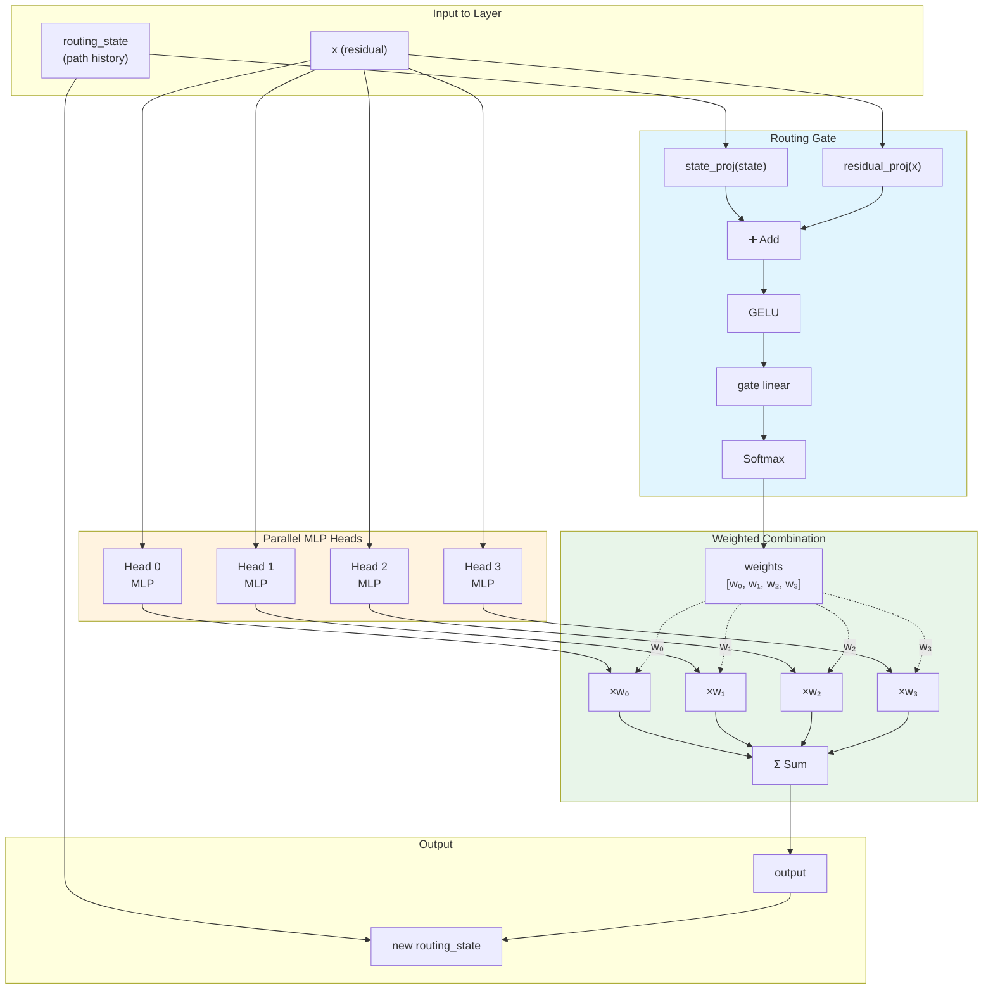
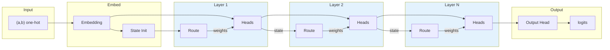

# Least Action Learning

Neural networks that learn efficient computational paths through routing mechanisms.

## Hypothesis

A network trained with routing mechanisms and efficiency regularization will learn to use minimal sufficient computation—discovering efficient paths for simple problems while retaining capacity for harder ones.

## Quick Start

```bash
# From repository root
source .venv/bin/activate

# Run baseline grokking experiment
python projects/least_action_learning/scripts/train.py --config projects/least_action_learning/configs/baseline.yaml

# Run routed network with entropy regularization
python projects/least_action_learning/scripts/train.py --config projects/least_action_learning/configs/routed.yaml

# Quick test with smaller problem
python projects/least_action_learning/scripts/train.py --p 17 --epochs 5000 --model-type routed
```

## Architecture

The core architecture uses **soft routing** through parallel MLP heads:

```
Input (a, b) one-hot
    │
    ▼
[Embedding] → residual
    │
    ▼
routing_state = RouteInit(residual)
    │
    ▼
┌─ Routed Layer ────────────────────────┐
│  heads = [MLP_a, MLP_b, MLP_c, ...]   │
│  weights = RouteGate(state, residual) │
│  output = Σ weights[i] * heads[i](x)  │
│  state = RouteUpdate(state, output)   │
└───────────────────────────────────────┘
    │
    ▼ (repeat N layers)
    │
    ▼
[Output Head] → logits
```

Key features:
- **Soft routing**: Paths are weighted, not pruned—all heads contribute
- **Input-dependent**: Routing decisions depend on "path so far" + "new info"
- **Interpretable**: Can visualize which heads handle which inputs

### Routing Gate Mechanism



### Full Network Flow



### Routing Decision Logic

The key insight is that routing at layer $l$ depends on:

1. **Routing state** $s_{l-1}$: Compressed history of "which path did we take to get here?"
2. **New residual** $x_l$: "What new information do we have at this layer?"

```
weights_l = softmax(W_gate · GELU(W_state · s_{l-1} + W_residual · x_l))
output_l = Σᵢ weights_l[i] · head_i(x_l)
s_l = W_update · [s_{l-1}; output_l]
```

This allows the network to learn **input-dependent routing** where different inputs take different computational paths through the network.

## Regularizers

Three regularization approaches to encourage efficient routing:

1. **Entropy** (`--routing-reg entropy`): Encourage decisive routing (low entropy)
2. **Sparsity** (`--routing-reg sparsity`): Encourage concentration on few heads
3. **Spectral** (`--lambda-spectral 0.1`): Encourage smooth (low-frequency) output functions

## Experiments

See `configs/sweep.yaml` for the full experimental plan:

| Phase | Goal |
|-------|------|
| 1 | Baseline MLPs at different depths |
| 2 | Routed network without regularization |
| 3 | Routing regularization sweep |
| 4 | Spectral smoothness experiments |
| 5 | Problem complexity scaling |
| 6 | Interpretability analysis |

## Project Structure

```
least_action_learning/
├── src/
│   ├── data.py         # ModularArithmeticDataset
│   ├── models.py       # BaselineMLP, RoutedNetwork
│   ├── routing.py      # RoutingGate, RoutedLayer
│   ├── losses.py       # Regularizers, spectral smoothness
│   ├── trainer.py      # Training loop
│   ├── metrics.py      # Routing metrics
│   └── visualize.py    # Plotting utilities
├── configs/
│   ├── baseline.yaml   # Standard grokking baseline
│   ├── routed.yaml     # Routed with entropy reg
│   └── sweep.yaml      # Full experiment sweep
├── scripts/
│   └── train.py        # Main training script
└── notebooks/          # Analysis notebooks
```

## Outputs

Training produces:
- `history.parquet`: Training metrics over time
- `config.json`: Experiment configuration
- `best.pt`: Best model checkpoint
- `plots/`: Visualization figures
  - `training_curves.png`: Loss and accuracy
  - `routing_layer_*.png`: Routing heatmaps per layer
  - `spectral_analysis.png`: Fourier analysis of outputs

## Key Metrics

| Metric | Description |
|--------|-------------|
| `test_acc` | Test accuracy (key grokking metric) |
| `routing_entropy` | Decisiveness of routing (lower = more decisive) |
| `head_utilization` | Average weight per head |
| `spectral_smoothness` | Low-frequency energy ratio |

## References

- Power et al. (2022) — "Grokking: Generalization Beyond Overfitting"
- Nanda et al. (2023) — "Progress measures for grokking via mechanistic interpretability"
- Shazeer et al. (2017) — "Sparsely-Gated Mixture-of-Experts Layer"
