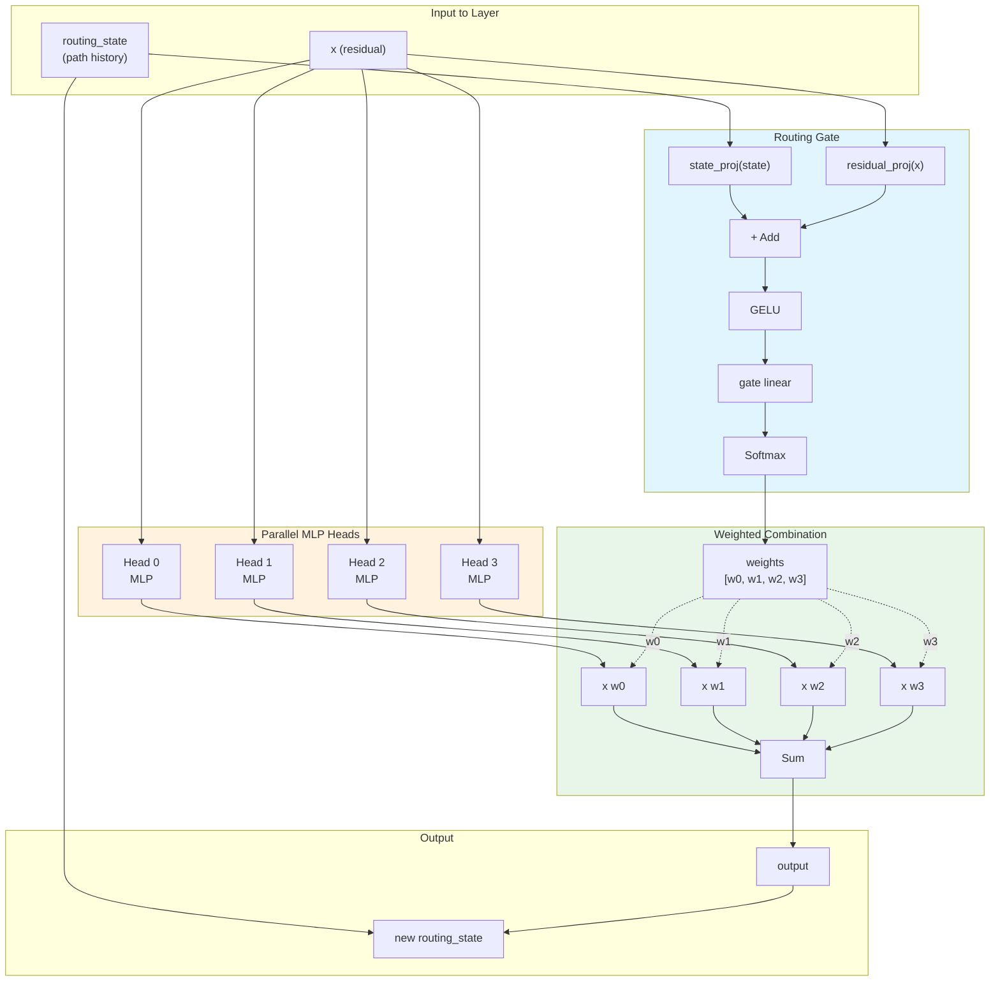
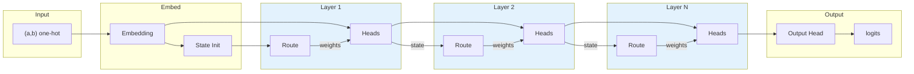

# Least Action Learning: Experiment Plan

## Hypothesis

A neural network trained with a composite loss that penalizes computational cost (depth/active layers) will learn to use minimal sufficient complexity — discovering simple solutions for simple problems while retaining capacity for harder ones.

This mirrors the principle of least action from physics and human learning behavior (satisficing over optimizing).

---

## Architecture

### Model Types

| Type | Description | Config `model_type` |
|------|-------------|---------------------|
| BaselineMLP | Standard MLP with GELU activations | `"baseline"` |
| RoutedNetwork | MLP with learned routing through parallel heads | `"routed"` |
| GrokTransformer | Decoder-only transformer matching original paper | `"transformer"` |

### Routing Gate Mechanism

The core architecture uses **soft routing** through parallel MLP heads:

```
Input (a, b) one-hot
    |
    v
[Embedding] -> residual
    |
    v
routing_state = RouteInit(residual)
    |
    v
+- Routed Layer --------------------+
|  heads = [MLP_a, MLP_b, MLP_c, ...]   |
|  weights = RouteGate(state, residual) |
|  output = sum weights[i] * heads[i](x)  |
|  state = RouteUpdate(state, output)   |
+-----------------------------------+
    |
    v (repeat N layers)
    |
    v
[Output Head] -> logits
```

Key features:
- **Soft routing**: Paths are weighted, not pruned - all heads contribute
- **Input-dependent**: Routing decisions depend on "path so far" + "new info"
- **Interpretable**: Can visualize which heads handle which inputs



### Full Network Flow



### Routing Decision Logic

The key insight is that routing at layer l depends on:

1. **Routing state** s_{l-1}: Compressed history of "which path did we take to get here?"
2. **New residual** x_l: "What new information do we have at this layer?"

```
weights_l = softmax(W_gate * GELU(W_state * s_{l-1} + W_residual * x_l))
output_l = sum_i weights_l[i] * head_i(x_l)
s_l = W_update * [s_{l-1}; output_l]
```

This allows the network to learn **input-dependent routing** where different inputs take different computational paths through the network.

---

## 1. Data Generation

**Core requirements:**
- Modular arithmetic with configurable prime p
- Configurable train/test split ratio
- Multiple operation support (addition first, multiplication later)
- Reproducible splits via seeding

```python
class ModularArithmeticDataset:
    def __init__(
        self, 
        p: int, 
        operation: str = "add", 
        train_frac: float = 0.3, 
        seed: int = 42
    ):
        ...
    
    def get_train(self) -> tuple[Tensor, Tensor]:
        ...
    
    def get_test(self) -> tuple[Tensor, Tensor]:
        ...
```

**Input representation:**
- One-hot encoding of (a, b) → 2p input dimensions
- Matches grokking literature for comparability

**Split methodology:**
- For mod p, full dataset is p² pairs
- Random split into train/test (e.g., 30% train)
- No distributional shift — network must learn algorithm to generalize

---

## 2. Network Architecture

**Base abstraction:**

```python
class GatedNetwork(nn.Module):
    """
    Variable-depth network where each layer has:
    - weights W_l
    - gate parameter g_l ∈ [0, 1] controlling layer activation
    """
    
    def forward(self, x) -> tuple[Tensor, ComputeMetrics]:
        # Returns both prediction AND compute metadata
        ...
    
    def compute_cost(self) -> Tensor:
        # Differentiable compute cost for loss
        ...
```

**Design decisions:**

| Decision | Options | Initial choice |
|----------|---------|----------------|
| Gate parameterization | Sigmoid(learnable), gumbel-softmax, straight-through | Sigmoid |
| What gates control | Layer output scaling, skip connection strength | Output scaling |
| Cost function | Sum of gates, FLOP-weighted, entropy | Sum of gates |
| Architecture | Fixed max depth, dynamically growable | Fixed max depth (10 layers) |

**Compute cost function options:**

```python
def compute_cost_sum(gates: Tensor) -> Tensor:
    """Simple sum of gate activations."""
    return gates.sum()

def compute_cost_weighted(gates: Tensor, layer_sizes: list[tuple[int, int]]) -> Tensor:
    """Weight by layer FLOPs — heavier layers cost more."""
    flops = torch.tensor([s_in * s_out for s_in, s_out in layer_sizes])
    return (gates * flops).sum()

def compute_cost_entropy(gates: Tensor) -> Tensor:
    """Encourage binary decisions, penalize half-on gates."""
    eps = 1e-8
    return -(gates * (gates + eps).log() + (1 - gates) * (1 - gates + eps).log()).sum()
```

---

## 3. Training Infrastructure

```python
@dataclass
class ExperimentConfig:
    # Data
    p: int = 113
    operation: str = "add"
    train_frac: float = 0.3
    
    # Architecture
    n_layers: int = 10
    hidden_dim: int = 128
    gate_type: str = "sigmoid"  # or "gumbel", "straight_through"
    
    # Loss
    task_loss: str = "cross_entropy"
    compute_cost_fn: str = "sum"  # or "weighted", "entropy"
    lambda_compute: float = 0.01
    
    # Training
    optimizer: str = "adamw"
    lr: float = 1e-3
    weight_decay: float = 0.1
    epochs: int = 50_000
    batch_size: int = -1  # full batch by default
    
    # Logging
    log_every: int = 100
    seed: int = 42
    
    # Experiment metadata
    name: str = ""
    notes: str = ""


class Trainer:
    def __init__(self, config: ExperimentConfig):
        self.config = config
        self.model = self._build_model()
        self.optimizer = self._build_optimizer()
        self.data = ModularArithmeticDataset(...)
        self.logger = ExperimentLogger(config)
    
    def train_step(self) -> dict[str, float]:
        """Single training step, returns metrics dict."""
        ...
    
    def evaluate(self) -> dict[str, float]:
        """Evaluate on test set."""
        ...
    
    def run(self):
        """Full training loop."""
        for epoch in range(self.config.epochs):
            metrics = self.train_step()
            if epoch % self.config.log_every == 0:
                test_metrics = self.evaluate()
                self.logger.log(epoch, {**metrics, **test_metrics}, self.model.get_gates())
```

### Regularizers

Three regularization approaches to encourage efficient routing:

1. **Entropy** (`--routing-reg entropy`): Encourage decisive routing (low entropy)
2. **Sparsity** (`--routing-reg sparsity`): Encourage concentration on few heads
3. **Spectral** (`--lambda-spectral 0.1`): Encourage smooth (low-frequency) output functions

---

## 4. Visualization / Metrics

**Metrics to track per step:**

| Metric | Description |
|--------|-------------|
| `train_loss` | Task loss only (cross-entropy) |
| `test_loss` | Task loss on held-out pairs |
| `train_acc` | Training accuracy |
| `test_acc` | Test accuracy (key metric for grokking) |
| `compute_cost` | The penalty term value |
| `total_loss` | task_loss + λ × compute_cost |
| `gate_values` | Vector of all gate activations |
| `effective_depth` | Sum of gates (or count where gate > 0.5) |
| `gate_entropy` | How "decided" the gates are |

**Visualizations:**

1. **Loss curves**
   - Train/test accuracy over time
   - Should show grokking transition (memorization → generalization)
   - Compare across λ values

2. **Gate evolution heatmap**
   - X-axis: training step
   - Y-axis: layer index
   - Color: gate value
   - Should show layers "turning off" if hypothesis holds

3. **Effective depth over time**
   - Single line showing network simplifying
   - Overlay with test accuracy to see correlation

4. **Phase diagram**
   - For different λ values: plot (final accuracy, final effective depth)
   - Look for Pareto frontier

5. **Grokking time vs λ**
   - When does test accuracy cross 90%?
   - Does compute pressure accelerate or delay grokking?

```python
class ExperimentLogger:
    def __init__(self, config: ExperimentConfig):
        self.config = config
        self.history: list[dict] = []
        self.gate_history: list[Tensor] = []
    
    def log(self, step: int, metrics: dict[str, float], gates: Tensor):
        self.history.append({"step": step, **metrics})
        self.gate_history.append(gates.detach().clone())
    
    def plot_loss_curves(self) -> Figure:
        ...
    
    def plot_gate_evolution(self) -> Figure:
        ...
    
    def plot_depth_vs_accuracy(self) -> Figure:
        ...
    
    def save(self, path: str):
        """Persist experiment results."""
        ...
```

---

## 5. Experimental Permutations

### Phase 1: Validate basic setup
**Goal:** Replicate standard grokking behavior

- Baseline with λ=0 (no compute penalty)
- Confirm memorization → generalization transition
- Establish baseline grokking time

**Success criteria:** Test accuracy jumps from ~random to >95% after extended training

---

### Phase 2: Compute cost sweep
**Goal:** Understand effect of compute penalty

| Experiment | λ value | Question |
|------------|---------|----------|
| 2a | 0.001 | Minimal pressure — any effect? |
| 2b | 0.01 | Moderate pressure |
| 2c | 0.1 | Strong pressure |
| 2d | 1.0 | Dominant pressure — does learning still happen? |

**Key questions:**
- Does increasing λ speed up grokking?
- Does it prevent grokking entirely at high values?
- Does it change the solution found?

---

### Phase 3: Architecture variations
**Goal:** Test if network learns minimal necessary depth

| Experiment | Max depth | Hidden dim | Question |
|------------|-----------|------------|----------|
| 3a | 4 | 128 | Constrained — can it still solve? |
| 3b | 8 | 128 | Moderate capacity |
| 3c | 16 | 128 | Excess capacity |
| 3d | 10 | 64 | Narrower |
| 3e | 10 | 256 | Wider |

**Key question:** Does the network learn to use only what it needs regardless of available capacity?

---

### Phase 4: Cost function variations
**Goal:** Find best formulation of "computational efficiency"

| Experiment | Cost function | Description |
|------------|---------------|-------------|
| 4a | sum | Simple sum of gates |
| 4b | weighted | FLOP-weighted by layer size |
| 4c | entropy | Penalize uncertain gates |
| 4d | sum + entropy | Combine sparsity and decisiveness |

**Key question:** Which cost formulation best captures computational efficiency?

---

### Phase 5: Problem complexity
**Goal:** Test if network adapts depth to problem difficulty

| Experiment | Prime p | Operation | Expected difficulty |
|------------|---------|-----------|---------------------|
| 5a | 17 | add | Easy |
| 5b | 113 | add | Medium (baseline) |
| 5c | 251 | add | Harder |
| 5d | 113 | multiply | Harder (different structure) |

**Key question:** Does the network learn deeper representations for harder problems?

---

### Phase 6: Mechanistic interpretability
**Goal:** Understand what algorithms are learned (if results are interesting)

- Fourier analysis of learned weights (following Nanda et al.)
- Compare weight structure between high-λ and low-λ solutions
- Visualize gate patterns per input (if per-neuron gates)

**Key question:** Does compute pressure change *what* algorithm is learned, or just how efficiently?

---

## Implementation Status

Tracking what has been implemented vs. originally planned:

- [x] Phase 1: Baseline validation (MLP and Transformer)
- [x] Transformer experiments with hyperparameter sweeps
- [x] Weight decay sweep (new_year_validation_sweep.yaml)
- [x] Analysis layer (`src/analysis/`) for notebook-friendly exploration
- [x] Gradio visualizer with multi-experiment support
- [x] Curvature metrics (Jacobian, Hessian, gradient norm, Fisher)
- [x] Adam optimizer dynamics tracking
- [x] Per-layer weight norm tracking
- [ ] Routed network experiments (Phase 2-4)
- [ ] Problem complexity scaling (Phase 5)
- [ ] Mechanistic interpretability analysis (Phase 6)

---

## 6. Implementation Order (Historical)

```
Week 1:
├── Day 1-2: Data generation + baseline MLP (no gates)
│            Replicate standard grokking
├── Day 3-4: Add gating mechanism + compute cost
│            Verify gradients flow correctly
└── Day 5:   Logging and visualization infrastructure

Week 2:
├── Day 1-2: Run Phase 1-2 experiments
├── Day 3-4: Analyze results, iterate on architecture
└── Day 5:   Phase 3 experiments if Phase 2 shows signal

Week 3+:
└── Phases 4-6 based on findings
```

---

## 7. Open Design Questions

### Resolved:
- **Optimizer:** AdamW (standard for grokking work)
- **Gate scope:** Per-layer (simpler, more interpretable to start)

### To resolve empirically:
- **Gate initialization:** Start at 1.0 (fully on) vs 0.5 (uncertain)
  - Hypothesis: 1.0 is better — let training "turn off" unnecessary layers
  - Will test both

- **Weight decay on gates:** Should gates have weight decay?
  - With decay: pressure toward 0 (off)
  - Without decay: only compute cost provides pressure
  - Will test both

- **Learning rate for gates:** Same as weights or different?
  - Gates might need slower updates to avoid instability
  - Will test with separate lr if needed

---

## Implementation Notes

Key lessons learned from implementation:

### Weight Decay
- Critical for grokking: typical range 1.0-2.0
- Must exclude embeddings, biases, and LayerNorm parameters from weight decay
- Higher weight decay generally leads to faster grokking but may reduce final performance

### Optimizer Configuration
- Use `beta2=0.98` instead of 0.999 for more stable training (shorter optimizer memory)
- Linear LR warmup (500 epochs) prevents early training instability
- AdamW with `eps=1e-8` works well

### Training Stability
- Full-batch training is standard for grokking experiments
- Train/test split of 30-50% typical; smaller training sets grok faster but may be less reliable
- Gradient clipping (1.0) helps with occasional spikes

### Transformer-Specific
- Pre-norm architecture (LayerNorm before attention/FFN) is more stable
- Optional weight tying reduces parameters without hurting performance
- Token format: `[a, op, b, =]` with vocabulary size `p + 2`

---

## 8. Success Criteria

**Minimum viable result:**
- Networks trained with λ > 0 achieve comparable accuracy with measurably lower effective depth
- Gate evolution shows clear "simplification" pattern over training

**Interesting result:**
- Compute pressure accelerates grokking (finds efficient solution faster)
- Network depth correlates with problem complexity across Phase 5

**Exciting result:**
- Different λ values lead to qualitatively different learned algorithms (visible in Fourier analysis)
- Emergence of "early exit" behavior where easy inputs use fewer layers

---

## Related Documentation

- **Quick Start**: See [README.md](README.md) for installation and basic usage
- **Development Reference**: See [CLAUDE.md](CLAUDE.md) for code structure, APIs, and implementation details

---

## 9. References

- Power et al. (2022) — "Grokking: Generalization Beyond Overfitting on Small Algorithmic Datasets"
- Nanda et al. (2023) — "Progress measures for grokking via mechanistic interpretability"
- Graves (2016) — "Adaptive Computation Time for Recurrent Neural Networks"
- Liu et al. (2018) — "DARTS: Differentiable Architecture Search"