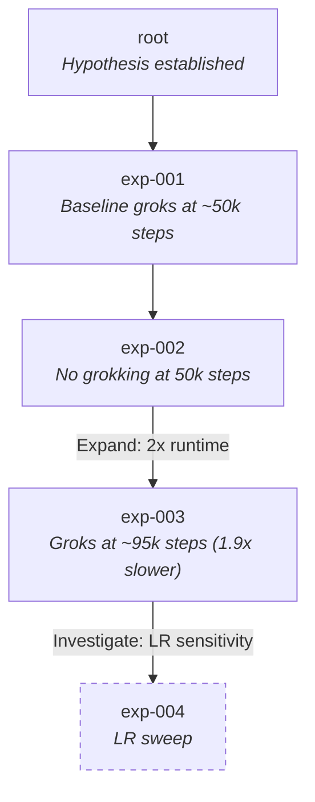

# Research Workflow

## Purpose

In an effort to automate research, we must first define a structured research workflow which captures process of a research practioner. This workflow lays out a foundation for which we can define explicit skills, procedures, and automated assistance into the workflow. 

### Ethos

The goal of research is to refine our "tastes" into tactical exploration that definitively answer ahypothesis--positively or negatively. The most exciting breakthroughs occur when we are able to prove mechanically that our intuition has a physical, reproducable property. As a result, it changes how practioners execute. Commonly, the core insight is distilled and bottled and foundational element which spreads prolifically.  

Yet, research should feel as though it is the pursuit of wisdom for humanity. To that end, this workflow is written with the intent that humans not only remain actively engaged in the research process, but they bear the responsibility of being stewards of taste and judgement. As Seneca says, "the truth lies open to all... Much is left for those who come after." Let us get after it, then!

## Structure

### Document Artifacts

The workflow produces three classes of documentation:

| Artifact | Purpose | Mutability |
|----------|---------|------------|
| **Working Report** | Accumulates findings across all phases; serves as the canonical record of the research trajectory | Append-only with timestamps |
| **Sub-reports** | Document specific experiments, ablations, and validation studies; referenced by Working Report | Immutable once generated |
| **Final Report** | Publication-ready synthesis; versioned snapshots as it evolves toward completion | Versioned (v0.1, v0.2, ...) |

### Phase Overview

| Phase | Entry Criterion | Exit Criterion | Key Deliverable |
|-------|-----------------|----------------|-----------------|
| **1. Exploration & Ideation** | Curiosity, intuition, or external prompt | Articulated idea with novelty assessment | Idea Brief |
| **2. Hypothesis Formation** | Idea Brief exists | Testable hypothesis with explicit success/failure criteria | Hypothesis Document |
| **3. Scientific Design** | Hypothesis Document exists | Complete experiment plan: ablations, metrics, baselines, exploration dimensions | Experiment Design |
| **4. Engineering Design** | Experiment Design exists | Runnable framework, indexing scheme, infrastructure for results | Code + Infrastructure |
| **5. Experimental Iteration** | Initial Framework ready | Core claim stabilizes (Commit decision) | Results DB + Sub-reports |
| **6. Commitment & Packaging** | Commit decision made | Reproducible package with polished narrative | Final Report + Clean Code |

Note: Phase 5 is iterative, and the hypothesis, scientific design, and engineering design may all need to be incrementally refined. When we've deviated significantly from our origination point - we can explicit move on (commit). This is defined in section 6. 


## Phase 5: Experimental Iteration

Phase 5 constructs an **experiment graph** through repeated cycles of execution, learning, and trajectory adjustment. The graph grows until the core claim stabilizes and a commit decision is made.

### The Experiment Graph

The experimental process is a directed graph where:

- **Nodes** represent completed experiment groups with their distilled findings
- **Edges** represent the reasoning that motivated moving from one experiment to another
- **The root** is the initial hypothesis
- **Leaves** are either committed findings or pruned dead-ends

#### Graph State

At any point during Phase 5, the graph has:

| Property | Description |
|----------|-------------|
| **Active Frontier** | Nodes with unexplored outgoing edges (experiments planned but not run) |
| **Current Position** | The node you're currently reasoning from |
| **Depth** | Distance from root to current position |
| **Breadth** | Size of active frontier |

**Frontier Warning:** If active frontier exceeds 5 nodes, flag for review. This indicates potential scope creep or insufficient pruning.

#### Graph Operations

| Operation | Graph Effect | Trigger |
|-----------|--------------|---------|
| **Spawn** | Add edge from current node to new planned experiment | Reflection suggests a new direction to explore |
| **Execute** | Traverse edge, create new node with results | Run the planned experiment |
| **Prune** | Mark node as leaf (dead-end), no further edges | Negative result accepted after expansion attempts |
| **Backtrack** | Move current position to ancestor node | Current branch exhausted or flawed; reason from earlier state |
| **Merge** | Create validation experiment connecting multiple branches | Convergent or complementary evidence requires unified test |
| **Commit** | Mark node as leaf (accepted finding), finalize | Core claim stable |

#### Merge Operations

Merge is distinct from other operations: it does not simply combine findings, but creates a **validation experiment** that tests the synthesized understanding.

Example: Branch A shows "method works at small scale." Branch B shows "different method works at large scale." A merge does not conclude "use A for small, B for large." Instead, it spawns a validation experiment: "Test both methods across scales to confirm the boundary and understand why."

Merge requires explicit human intervention. AI may propose merge candidates and draft validation experiment designs, but the human approves the synthesis framing.

### Graph Representation

The experiment graph is stored as a JSON file in the project repository, enabling programmatic traversal, visualization, and audit.

#### Schema
```json
{
  "hypothesis_id": "string",
  "hypothesis_statement": "string",
  "created_at": "ISO-8601 timestamp",
  "updated_at": "ISO-8601 timestamp",
  "nodes": {
    "<node_id>": {
      "id": "string (unique identifier)",
      "parent_ids": ["string (empty for root, multiple for merge)"],
      "edge_rationale": "string (why this experiment was spawned)",
      "experiment_group": "string (reference to experiment config)",
      "status": "planned | running | completed | pruned | committed",
      "sub_report_path": "string (path to sub-report, null if not completed)",
      "findings_summary": "string (one-line distillation)",
      "created_at": "ISO-8601 timestamp",
      "completed_at": "ISO-8601 timestamp or null"
    }
  },
  "current_position": "string (node_id)",
  "active_frontier": ["string (node_ids with status=planned)"],
  "metadata": {
    "total_nodes": "integer",
    "max_depth": "integer",
    "committed_count": "integer",
    "pruned_count": "integer"
  }
}
```

#### Example
```json
{
  "hypothesis_id": "H001",
  "hypothesis_statement": "Alternate transformer routing architecture achieves grokking faster than baseline",
  "created_at": "2025-01-10T09:00:00Z",
  "updated_at": "2025-01-17T14:30:00Z",
  "nodes": {
    "root": {
      "id": "root",
      "parent_ids": [],
      "edge_rationale": "Initial hypothesis",
      "experiment_group": null,
      "status": "completed",
      "sub_report_path": null,
      "findings_summary": "Hypothesis established; baseline metrics defined",
      "created_at": "2025-01-10T09:00:00Z",
      "completed_at": "2025-01-10T09:00:00Z"
    },
    "exp-001": {
      "id": "exp-001",
      "parent_ids": ["root"],
      "edge_rationale": "Test baseline grokking behavior on routing dataset",
      "experiment_group": "baseline_routing_v1",
      "status": "completed",
      "sub_report_path": "reports/exp-001-baseline.md",
      "findings_summary": "Baseline groks at ~50k steps",
      "created_at": "2025-01-10T10:00:00Z",
      "completed_at": "2025-01-11T08:00:00Z"
    },
    "exp-002": {
      "id": "exp-002",
      "parent_ids": ["exp-001"],
      "edge_rationale": "Test alternate architecture under same conditions",
      "experiment_group": "alt_arch_routing_v1",
      "status": "completed",
      "sub_report_path": "reports/exp-002-alt-arch.md",
      "findings_summary": "No grokking observed at 50k steps",
      "created_at": "2025-01-11T09:00:00Z",
      "completed_at": "2025-01-12T12:00:00Z"
    },
    "exp-003": {
      "id": "exp-003",
      "parent_ids": ["exp-002"],
      "edge_rationale": "Expand: extend runtime 2x to test slower grokking hypothesis",
      "experiment_group": "alt_arch_routing_v1_extended",
      "status": "completed",
      "sub_report_path": "reports/exp-003-extended.md",
      "findings_summary": "Grokking observed at ~95k steps; 1.9x slower than baseline",
      "created_at": "2025-01-12T13:00:00Z",
      "completed_at": "2025-01-14T20:00:00Z"
    },
    "exp-004": {
      "id": "exp-004",
      "parent_ids": ["exp-003"],
      "edge_rationale": "Investigate: hyperparameter sensitivity on learning rate",
      "experiment_group": "alt_arch_lr_sweep",
      "status": "planned",
      "sub_report_path": null,
      "findings_summary": null,
      "created_at": "2025-01-15T09:00:00Z",
      "completed_at": null
    }
  },
  "current_position": "exp-003",
  "active_frontier": ["exp-004"],
  "metadata": {
    "total_nodes": 5,
    "max_depth": 4,
    "committed_count": 0,
    "pruned_count": 0
  }
}
```

### Visualization

The experiment graph can be rendered as a Mermaid diagram for quick visual inspection. The diagram is auto-generated from the JSON representation.

%%{init: {'theme': 'base', 'themeVariables': { 'primaryColor': '#f8fafc', 'primaryTextColor': '#1e293b', 'primaryBorderColor': '#334155', 'lineColor': '#64748b'}}}%%

graph TD
    subgraph Legend[Node Status Legend]
        direction LR
        L1[Completed]:::default
        L2[Planned]:::planned
        L3[Pruned]:::pruned
        L4[Committed]:::committed
    end

    root[H001: Root<br/>Alternate routing arch<br/>achieves faster grokking]

    %% Branch A: Baseline characterization
    expA1[A.1: Baseline<br/>Groks at ~50k steps]
    expA2[A.2: Alt arch v1<br/>No grokking at 50k]
    expA3[A.3: Extended run<br/>Groks at ~95k steps<br/>1.9x slower]:::committed

    %% Branch B: Architecture variants
    expB1[B.1: Alt arch v2<br/>Deeper network]
    expB2[B.2: Extended run<br/>Still no grokking at 100k]:::pruned

    %% Branch C: Hyperparameter exploration
    expC1[C.1: LR sweep<br/>on alt arch v1]:::planned
    expC2[C.2: Batch size<br/>exploration]:::planned

    %% Merge node
    expM1[M.1: Validation<br/>Compare v1 vs baseline<br/>across scales]:::planned

    root --> expA1
    expA1 --> expA2
    expA2 -->|Expand: 2x runtime| expA3

    root --> expB1
    expB1 -->|Expand: 2x runtime| expB2

    expA3 -->|Investigate: LR sensitivity| expC1
    expA3 -->|Investigate: batch effects| expC2

    expA3 -.->|Merge: validate finding| expM1
    expB2 -.->|Merge: contrast failure| expM1

    classDef default fill:#f8fafc,stroke:#334155,stroke-width:2px,color:#1e293b
    classDef planned fill:#fef9c3,stroke:#ca8a04,stroke-width:2px,stroke-dasharray:5 5,color:#713f12
    classDef pruned fill:#fee2e2,stroke:#dc2626,stroke-width:2px,color:#991b1b
    classDef committed fill:#dcfce7,stroke:#16a34a,stroke-width:4px,color:#14532d

    linkStyle 8,9 stroke:#9333ea,stroke-width:2px,stroke-dasharray:3 3

#### Rendering Rules

| Node Status | Shape | Style |
|-------------|-------|-------|
| completed | Rectangle | Default |
| planned | Rectangle | Dashed border |
| running | Rectangle | Bold border |
| pruned | Rectangle | Strikethrough, grayed |
| committed | Rectangle | Double border, highlighted |

#### Example Mermaid Output


### The Iteration Cycle

Each cycle through Phase 5 performs one or more graph operations:

| Step | Activity | Graph Operations | Output |
|------|----------|------------------|--------|
| **5.1 Execute** | Run experiment group | Execute (edge traversal → node creation) | Raw results, logs, model snapshots |
| **5.2 Distill** | Generate sub-report, extract metrics | Update node with findings_summary, sub_report_path | Sub-report (immutable), node updated |
| **5.3 Reflect** | Interpret findings, assess hypothesis, attempt core claim | None (reasoning step) | Reflection notes in Working Report |
| **5.4 Decide Trajectory** | Choose next graph operation(s) | Spawn, Prune, Backtrack, Merge, or Commit | Updated graph, rationale documented |

### Reflection Prompts

At each Reflect step (5.3), answer the following and append to the Working Report:

1. **What did this experiment show?** (One sentence)
2. **Does this change our understanding of the hypothesis?** (Yes/No + explanation)
3. **Can I state the core claim now?** (Attempt a one-sentence claim, or explain what's missing)
4. **What is the strongest counterargument to the current findings?** (Steel-man the opposition)
5. **What would change my mind?** (Define falsification criteria for next cycle)

When answers to prompts 3-5 remain stable across two consecutive cycles, consider a Commit decision.

### Handling Negative Results

A negative result ("it doesn't work") requires verification before Prune:

1. **Expand**: Relax constraints—extend runtime by ~2x or within an order of magnitude
2. **Sensitivity**: Sweep hyperparameters across defined exploration dimensions
3. **Verify**: Confirm implementation correctness (may require Backtrack to Engineering Design)

A Prune is accepted when:
- Expansion has been attempted
- The *reason* for failure is understood and documented
- The finding prevents others from repeating the dead end

**Pruned nodes are valid research outcomes.** They constrain the space of possibilities and may become part of the Final Report's contribution.

### AI Role in Phase 5

| Operation | AI Capability | Human Role |
|-----------|---------------|------------|
| **Spawn** | Propose candidate edges with rationale; estimate resource cost | Select which edges to add; approve rationale |
| **Execute** | Fully autonomous: run experiment, create node, generate sub-report | Monitor; intervene on failure |
| **Prune** | Recommend prune when expansion heuristics exhausted | Approve; ensure "why it failed" is documented |
| **Backtrack** | Detect when current branch is stuck; suggest backtrack targets | Decide whether to backtrack or persist |
| **Merge** | Identify merge candidates; propose validation experiment design | Approve synthesis framing; design validation |
| **Commit** | Detect claim stability; prompt for commitment | Make the call; own the narrative |
| **Visualize** | Generate Mermaid diagram from JSON; highlight anomalies (frontier size, depth) | Review; use for communication |